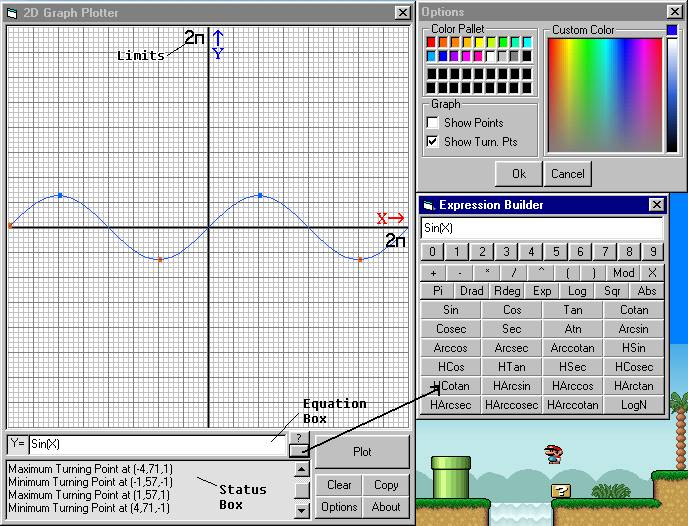



## A 2D Advanced Graph Plotter

### Description

2D Graph Plotter

This tool draws any graph you want on precice Axii.

Type the graph's equation in the box and press Plot.

There is an expression builder to help you with all

supported functions. All VB Math functions are supported

plus a bunch more trigonometric functions plus the ability

to support any function you want, just include it in the .bas

file along with the rest.

You can specify the maximum limits for drawing.

1:1 limit is 4

You can use copy to copy the graph to the clipboard

Your most clomplete tool for drawing graphs.

If you have an account please vote.
 
### More Info
 

             |
---                |---
**Submitted On**   |2003-07-05 15:39:48
**By**             |[Lefteris Eleftheriades](https://github.com/Planet-Source-Code/PSCIndex/blob/master/ByAuthor/lefteris-eleftheriades.md)
**Level**          |Intermediate
**User Rating**    |4.9 (79 globes from 16 users)
**Compatibility**  |VB 5\.0, VB 6\.0, ASP \(Active Server Pages\) 
**Category**       |[Graphics](https://github.com/Planet-Source-Code/PSCIndex/blob/master/ByCategory/graphics__1-46.md)
**World**          |[Visual Basic](https://github.com/Planet-Source-Code/PSCIndex/blob/master/ByWorld/visual-basic.md)
**Archive File**   |[A\_\_\_plaint161080762003\.zip](https://github.com/Planet-Source-Code/lefteris-eleftheriades-a-2d-advanced-graph-plotter__1-46695/archive/master.zip)

